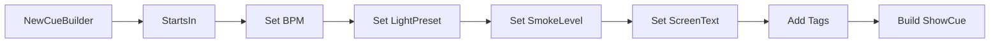
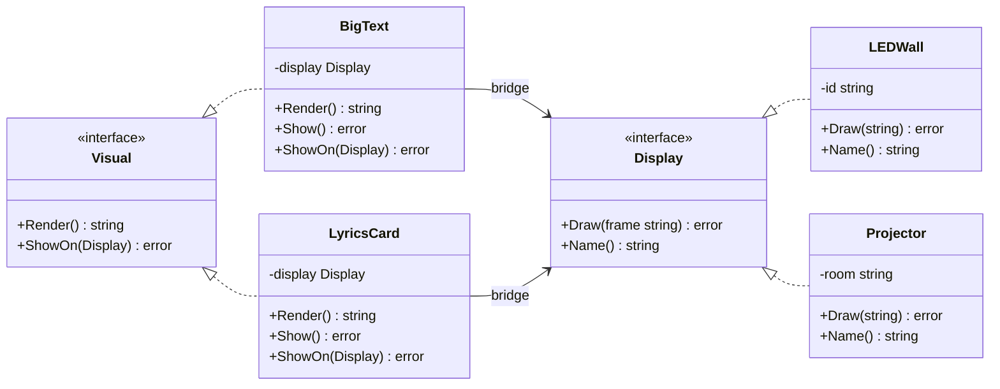
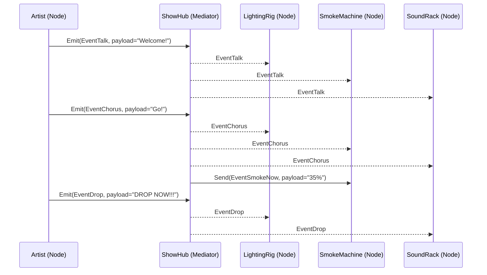
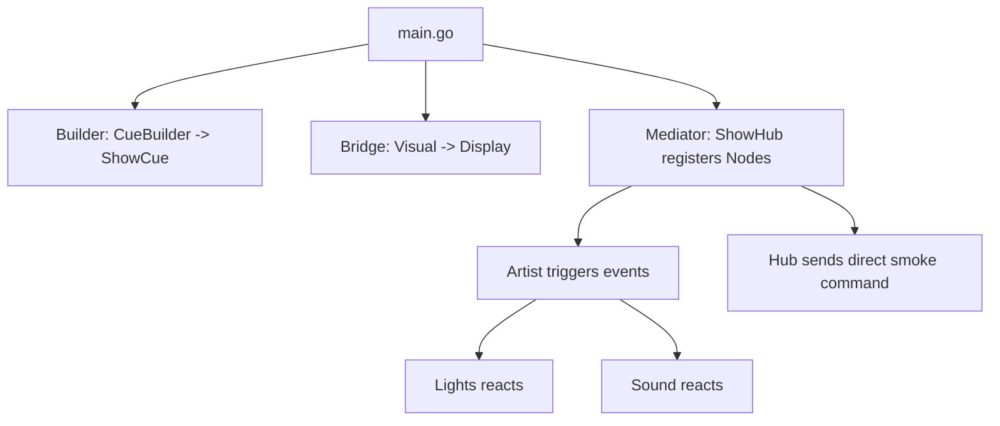

# Go Patterns Showcase: Builder • Bridge • Mediator

A Go project demonstrating three classic design patterns—**Builder** (creational), **Bridge** (structural), and **Mediator** (behavioral)—using a “live show / stage automation” theme.

The goal is to keep examples **practical**, **non-trivial**, and **Go-idiomatic**, while still being easy to understand and present.

---

## Table of Contents

- [Project Structure](#project-structure)
- [How to Run](#how-to-run)
- [Patterns Overview](#patterns-overview)
  - [1) Builder](#1-builder-creational)
  - [2) Bridge](#2-bridge-structural)
  - [3) Mediator](#3-mediator-behavioral)
- [How the Demo Flows](#how-the-demo-flows)
- [Notes on Go Style](#notes-on-go-style)

---

## Project Structure

```

.
├── go.mod
├── main.go
└── patterns
├── builder.go
├── bridge.go
└── mediator.go

````

- `patterns/` contains implementations of the patterns.
- `main.go` is a single entry point that uses all patterns together.

---

## How to Run

From the project root:

```bash
go run .
````

You should see output that includes:

* a built “cue” (Builder),
* rendered visuals on different display devices (Bridge),
* and coordinated stage reactions (Mediator).

---

## Patterns Overview

### 1) Builder (Creational)

**Intent:** Construct a complex object step-by-step, separating *construction* from *representation*.

In this project, `CueBuilder` builds a `ShowCue`—a stage “cue” containing:

* start offset,
* BPM,
* lighting preset,
* smoke level,
* screen text,
* and tags.

This is useful when an object has many optional parameters, validation rules, and you want fluent, readable configuration.

#### Where Builder is used in real systems

* Constructing HTTP requests / API clients with many options
* Building configuration objects (timeouts, retries, headers, feature flags)
* Creating complex domain objects (e.g., invoice generation, report definitions)
* Building objects with validation at creation time

#### Example: conceptual Builder flow



#### Why this Builder is Go-friendly

* It avoids giant constructors like `NewShowCue(a,b,c,d,e,f,...)`.
* It keeps validation in one place (`Build()`).
* Fluent chaining reads well in Go when used carefully.

---

### 2) Bridge (Structural)

**Intent:** Decouple an abstraction from its implementation so the two can vary independently.

In this project:

* **Abstraction:** `Visual` (what to show)

    * `BigText`
    * `LyricsCard`
* **Implementation:** `Display` (how/where to show)

    * `LEDWall`
    * `Projector`

You can combine any `Visual` with any `Display` **without multiplying classes**.

#### Where Bridge is used in real systems

* UI rendering: components (abstraction) vs platform backends (implementation)
* Messaging/notifications: message types vs delivery channels
* Storage: domain repository interface vs DB/file/memory implementations
* Drawing/graphics: shapes vs rendering APIs
* Payment: checkout flows vs payment providers

#### Bridge diagram (structure)



#### Why Bridge matters here

If you add:

* a new display device (`StreamOverlay`, `MobileScreen`, `WebCanvas`), **no changes** needed in visuals.
* a new visual type (`Countdown`, `SponsorCard`), **no changes** needed in displays.

---

### 3) Mediator (Behavioral)

**Intent:** Define an object that encapsulates how a set of objects interact, promoting loose coupling by preventing objects from referring to each other explicitly.

In this project:

* `ShowHub` is the mediator.
* Nodes (`Artist`, `LightingRig`, `SmokeMachine`, `SoundRack`) are colleagues.

Nodes do **not** call each other directly. They publish events via the hub.

#### Where Mediator is used in real systems

* Chat rooms, message buses, event aggregators
* GUI systems: components notifying a central controller
* Microservice orchestration (lightweight coordinator patterns)
* Game engines: game events coordinating objects (NPC, UI, physics, sound)
* Workflow systems: steps and triggers coordinated by a hub

#### Mediator diagram (message flow)



#### Why Mediator matters here

Without a mediator, each component (lights/sound/smoke) would need references to others:

* complicated wiring,
* brittle changes,
* hard-to-test logic.

With `ShowHub`, each node depends only on the mediator interface.

---

## How the Demo Flows

At a high level, `main.go` does:

1. **Builder:** Build a `ShowCue`.
2. **Bridge:** Show visuals on different displays.
3. **Mediator:** Register nodes and trigger show events.



---

## Notes on Go Style

* **Interfaces are small** and represent behavior (`Display`, `Node`, `StageHub`).
* Pattern implementations prefer **composition over inheritance** (Go doesn't do inheritance).
* Unexported fields (e.g., `name`) keep internal state encapsulated.
* Public methods (`Name()`) provide controlled access.


